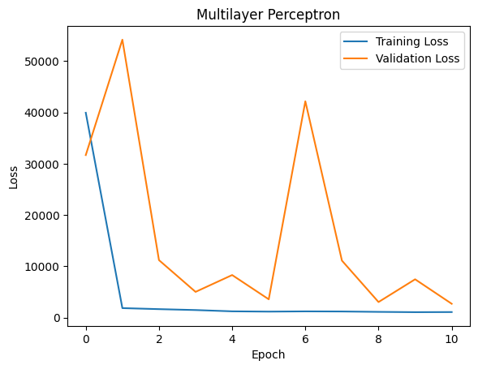
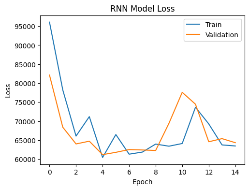
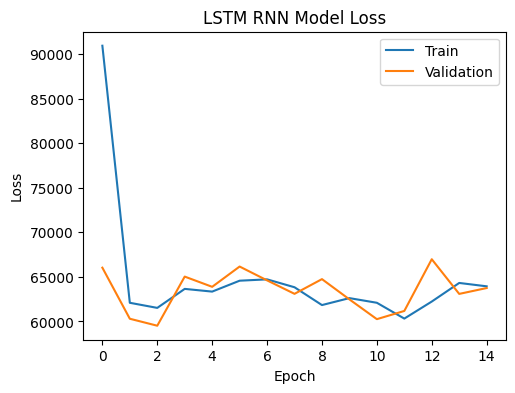
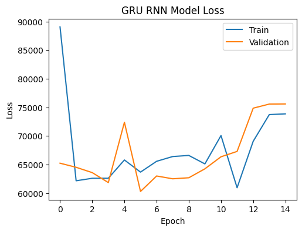

# Options Price Forecasting

## Description
The goal of the project is to utilize deep learning techniques to predict option prices. Options pricing is a complex task that requires analyzing various market factors and dynamics. Traditional models often struggle to capture the complex relationships in the data, which is why we saw the need for deep learning models. 

To tackle this problem, different deep learning models were trained:
1. Multilayer Perceptron
2. Recurrent Neural Network (RNN)
3. Long Short-Term Memory (LSTM)
4. Gated Recurrent Unit (GRU)

 
## Repository Structure
The repository is organized as such:
```
├── models
│	├── gru_calls
│	├── lstm_calls
│	├── mlp_calls
│	├── mlp_puts
│	└── rnn_calls
├── notebooks
│	├── mlp.ipynb
│	├──preprocessing.ipynb
│	└── rnn.ipynb
├── plots
│	├── gru.png
│	├── lstm.png
│	├── mlp.png
│	└── rnn.png
└── README.md
```

The models that were built are stored in the `models` folder. There are 4 models:
1. `gru_calls`: GRU model for predicting call prices.
2. `lstm_calls`: LSTM model for predicting call prices.
3. `mlp_calls`: MLP model for predicting call prices.
4. `mlp_puts`: MLP model for predicting put prices.
5. `rnn_calls`: RNN model for predicting call prices.

The notebooks containing our code and implementation are stored in the `notebooks` folder. There are 3 notebooks:
1. `mlp.ipynb`: code for MLP models (includes initial model, hyperparameter tuning, and final model)
2. `preprocessing.ipynb`: code for cleaning and preprocessing original dataset (includes feature engineering) 
3. `rnn.ipynb`: code for RNN models (includes Simple RNN, LSTM, and GRU)

Plots showing model performance during training can be found in the `plots` folder.

The datasets we used can be found here: https://drive.google.com/drive/folders/14UDaBowufW9BTIz6CvdKxtkL2l0c_DAB?usp=sharing

There are 5 CSV files:
 1. `options_tsla.csv`: the original dataset on TSLA options. This dataset was cleaned and preprocessed to create the other datasets in the folder.
 2. `calls_data.csv`: feature data for TSLA calls.
 3. `calls_target.csv`: target data for TSLA calls.
 4. `puts_data.csv`: feature data for TSLA puts.
 5. `puts_target.csv`: target data for TSLA puts.

## Executing the Code
To retrain the models, first download the data. The data then needs to be prepared for the various models. This can be done by running each cell in notebooks/preprocessing.ipynb in order.

To train the multilayer perceptron model, run each cell in notebooks/mlp.ipynb. Similarly, to train the SimpleRNN, LSTM, or GRU model, run the corresponding cell in notebooks/rnn.ipynb.

Alternatively, to load our pretrained models (stored in the `models` folder), run the following code:
```
import tensorflow as tf

model = tf.keras.models.load_model('path/to/model')
```

## Results and Observations
### Multilayer Perceptron
Training loss drops dramatically at epoch 1 before slowly decreasing with each subsequent epoch. Validation loss varies, with it decreasing throughout model training, spiking at epoch 6 before returning to normal. 

Overall Loss on Test Data: 2,693



### SimpleRNN
Training loss decreases throughout training but stagnates around epoch 6. After this it starts to increase, indicating overfitting. A similar pattern can be seen in validation loss, which stagnates around epoch 4.

Overall Loss on Test Data: 94,936



### LSTM
Training loss decreases throughout training but stagnates around epoch 10. After this it starts increases, again indicating overfitting in the model. The same pattern can be seen in the validation loss, which stagnates around epoch 11.

Overall Loss on Test Data: 93,557



### GRU
Training Loss varies wildly but actually increases during  training. It is minimized around epoch 11, before starting to increase again. Validation loss varies wildly but is at its lowest around epoch 5.

Overall Loss on Test Data: 86,404



### Conclusion
The MLP performed better than all three varieties of RNNs, with a loss of 2,693 on test data, compared to 94,936 for Simple RNN, 93,557 for LSTM, and 86,404 for GRU RNNs. Even when using the epoch with the lowest training loss for the RNNs resulted in loss around 60,000 on test data, which is still suboptimal.

This is likely because RNNs were designed to capture patterns over a period of time, with this being especially true for LSTMs which are intended to model long-term dependencies. However, given that our dataset contained only options exhancges from one trading day, there wasn’t enough data for sequential dependencies to be picked up.

Additionally due to their complexity, RNNs have a tendency to overfit, especially when given limited data. We tried to reduce the number of epochs to combat this but the models still tended to overtrain after 8-10 epochs. Given these limitations, the simpler architecture of the MLP made it a more robust model.

